# Intializing the project

    npm init -y
    truffle init
    npm i -D webpack react react-dom babel-core babel-loader babel-preset-react babel-preset-env css-loader style-loader json-loader web3@0.20.0
    npm i -g http-server

# Create webpack.config.js
From the project root folder

# Retrieve network and chain id's

    const networkId = await web3.eth.net.getId();
    const chainId = await web3.eth.getChainId();

from truffle develop,

    truffle(develop)> await web3.eth.net.getId()
    5777
    truffle(develop)> await web3.eth.getChainId()
    1337

# Deploy Smart Contracts with Metamask
You have your primary wallet in metamask and want to use that same wallet to deploy your smart contract across all networks including your ganache test network.

First, you need to add your ganache network to your metamask

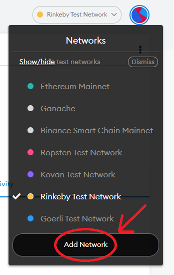

Press "Add Network", you will be redirected to your metamask settings page in your browser,

Give your network a name (Ganache is used), provide the URL and the chain id,

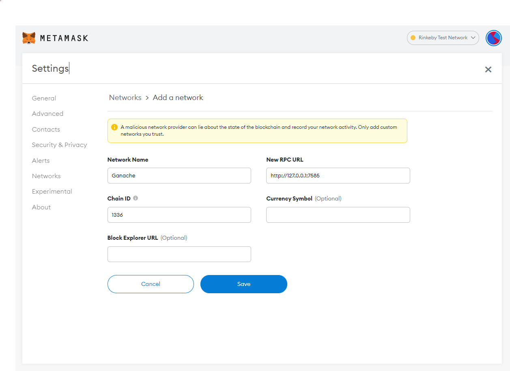

Now press Save.

You should be able to switch to the Ganache local network,

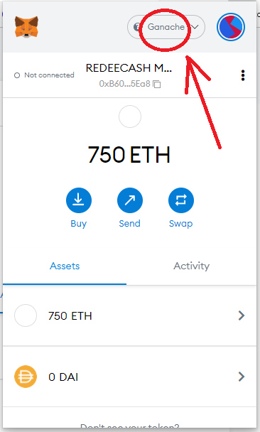

Next you will need to send some ether to your wallet on the Ganache network,

From a terminal window, start the truffle in local development mode,

    truffle console --network development

Obtain a list of the accounts, by issuing the "accounts" command at the truffle prompt,

    truffle(development)> accounts

you will see similar,

    [
        '0xceCd0C45Cf9B7b57CaB10BA0c88B2405d4c04c22',
        '0x2a3EFd59067528e1035791e3c7E7B86885d4a306',
        '0x621109909Ef726aa7E6587680235FF51B1a32b60',
        '0xA8BFfFff07da058eb638df62945Db6D1d2B46c1f',
        '0xD18A107105aCa0681525a2c6B5113D42042Eb92C',
        '0x80Ac7c0f5B38A4298fD121F76efb5450F4D92823',
        '0xcC814dFF84c044545832Fb5417149Fa6f8FAa1E7',
        '0x4A18Cdbf56Fb87d64E50e17538945c820488c943',
        '0x01E3E79Bb8840F453f3D140788377Be8FCA8D7A6',
        '0x5A0E78C053bDaBe950A6Ba5374360f875De2B275'
    ]

Each account has been initiated with 100 ether, you are going to send 75 ether from each account to your metamask wallet using the following command,

    web3.eth.sendTransaction({from: accounts[0], to:"PASTE_ACCOUNT_FROM_METAMASK", value: web3.utils.toWei("75","ether")})

or with my wallet,

    web3.eth.sendTransaction({from: accounts[0], to:"0xB6068565A9353F24a41C08321903bedc6b715Ea8", value: web3.utils.toWei("75","ether")})

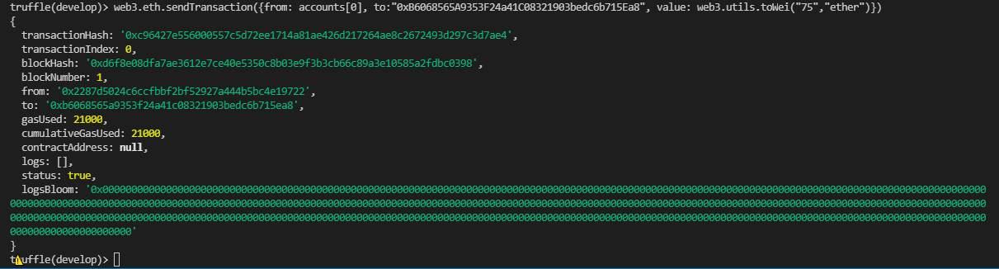

you can replicate for the next nine accounts,

    web3.eth.sendTransaction({from: accounts[1], to:"0xB6068565A9353F24a41C08321903bedc6b715Ea8", value: web3.utils.toWei("75","ether")})
    web3.eth.sendTransaction({from: accounts[2], to:"0xB6068565A9353F24a41C08321903bedc6b715Ea8", value: web3.utils.toWei("75","ether")})
    web3.eth.sendTransaction({from: accounts[3], to:"0xB6068565A9353F24a41C08321903bedc6b715Ea8", value: web3.utils.toWei("75","ether")})
    web3.eth.sendTransaction({from: accounts[4], to:"0xB6068565A9353F24a41C08321903bedc6b715Ea8", value: web3.utils.toWei("75","ether")})
    web3.eth.sendTransaction({from: accounts[5], to:"0xB6068565A9353F24a41C08321903bedc6b715Ea8", value: web3.utils.toWei("75","ether")})
    web3.eth.sendTransaction({from: accounts[6], to:"0xB6068565A9353F24a41C08321903bedc6b715Ea8", value: web3.utils.toWei("75","ether")})
    web3.eth.sendTransaction({from: accounts[7], to:"0xB6068565A9353F24a41C08321903bedc6b715Ea8", value: web3.utils.toWei("75","ether")})
    web3.eth.sendTransaction({from: accounts[8], to:"0xB6068565A9353F24a41C08321903bedc6b715Ea8", value: web3.utils.toWei("75","ether")})
    web3.eth.sendTransaction({from: accounts[9], to:"0xB6068565A9353F24a41C08321903bedc6b715Ea8", value: web3.utils.toWei("75","ether")})

and you should have 750 test ether in your wallet on your Ganache network.

WARNING: IF YOU STOP THE GANACHE NETWORK, YOU WILL LOOSE YOUR BALANCE!

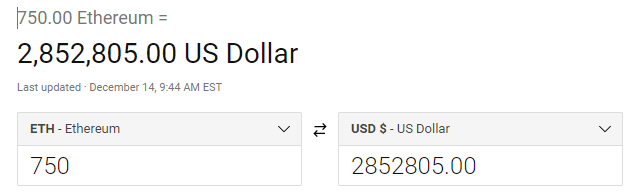

## Add HDWalletProvider and the Mnemonic to Truffle
You will need to install the HDWalletProvider (and dotenv) package in the project root folder,

    npm install @truffle/hdwallet-provider dotenv

then edit the truffle-config.js file, and add the following lines above module.exports statement,

    const path = require("path");
    require('dotenv').config({path: './.env'});
    const HDWalletProvider = require("@truffle/hdwallet-provider");
    const MetaMaskAccountIndex = 0;

then after the development item inside networks, add

    ganache_local: {
      provider: function() {
          return new HDWalletProvider(process.env.MNEMONIC, "http://127.0.0.1:8545", MetaMaskAccountIndex )
      },
      network_id: "*"
    },

where the url is the ganache url.

then add the Mnemonic from MetaMask to the .env file, by exporting your metamask secret keys and saving in a local .env file,

press the world icon to display the menu,

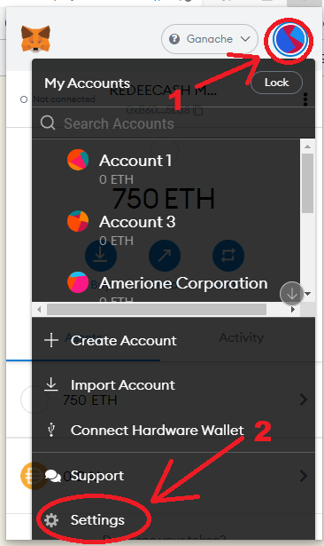

then press the "Settings" option,

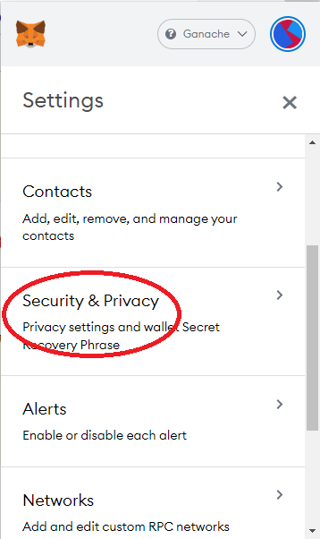

then press the Security & Privacy choice,

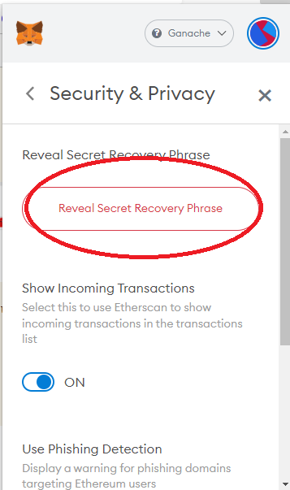

press the "Reveal Secret Recovery Phrase" button,

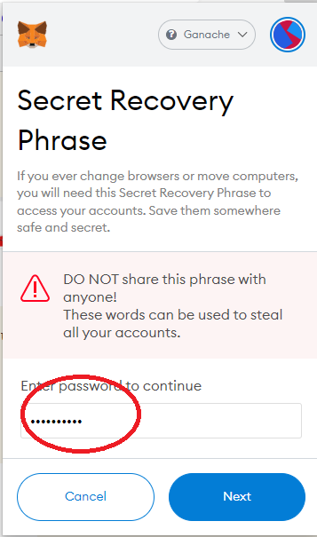

enter your metamask password and press next,

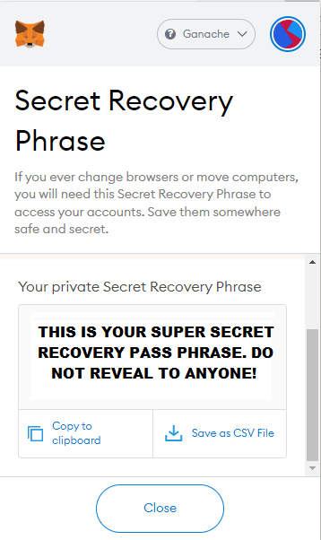

press the "Copy to clipboard" button,

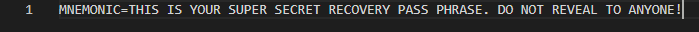

and paste your passphrase to the MNEMONIC= label and save the file.

You can end the truffle development session and start a truffle ganache session using the following command,

    truffle console --network ganache_local

at the prompt, migrate and deploy your contract,

    truffle(ganache_local)> migrate

or at the terminal prompt,

    > truffle migrate --network ganache_local

# Using GETH Blockchain with Truffle (Experimental)
This section is experimental!

    geth init ./genesis.json 
    geth --networkid 987 --rpc --rpccorsdomain "*" --rpcapi "db,eth,net,web3,personal,miner"
    
    geth --mine --miner.threads=4 --miner.etherbase=eth.coinbase

    geth --testnet --rpc --rpcapi db,eth,web3,net,personal --data-dir "C:\EthereumTestnet" --rpcaddr 192.167.0.100 --rpcport 1234

    web3.fromWei(eth.getBalance(eth.coinbase),"ether")

    curl -X POST http://127.0.0.1:8545 -H "Content-Type: application/json" --data '{"jsonrpc":"2.0", "method":"eth_getBalance", "params": ["0xb2e234df1730f908872d57c3fc115d96617cd53c","latest"], "id":1}'

    geth --testnet --networkid 5960 --rpc --rpcaddr 192.168.0.100 --rpcport 1234 --rpcapi db,eth,net,web3,personal,miner

from geth client:

    > personal.unlockAccount(eth.coinbase)
    enter password